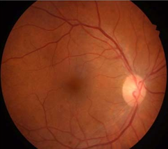

# Implementation of CANet: Cross-Disease Attention Network for Joint Diabetic Retinopathy and Diabetic Macular Edema Grading

## Paper
[CANet: Cross-Disease Attention Network for Joint Diabetic Retinopathy and Diabetic Macular Edema Grading](https://pubmed.ncbi.nlm.nih.gov/31714219/)


#### Sample retinal fundus image from IDRiD dataset with DR DME Grade 2
## Setup

### 1. Clone the repository
```bash
git clone https://github.com/swatimishra02/Joint-DR-DME-Grading---CANet-Implementation
cd DR DME grading
```
### 2. Setup
- pip install -r requirements.txt
- Download the [IDRiD Dataset]{https://ieee-dataport.org/open-access/indian-diabetic-retinopathy-image-dataset-idrid} and place it in the IDRiD folder.
- Train the model : python train.py
- visualise results : python results.py
- To create SHAP explanation graphs, run: shap_viz.py
  


#### SHAP implementation results


#### Model performance on test images

